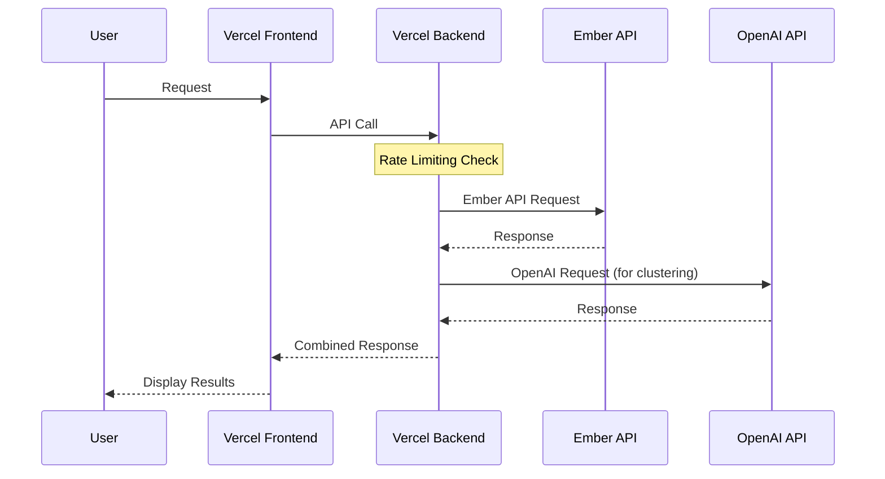

# Vercel Deployment (abandoned)

## Overview
This document outlines the requirements and considerations for deploying the Steering Interface application on Vercel, with a focus on minimizing complexity and ensuring security.

## Technical Requirements

### Core Behaviors
1. Secure API Key Management
   - Protect Ember API key from unauthorized access
   - Protect OpenAI API key from unauthorized access
   - Implement IP-based rate limiting (100 requests per IP per hour) to prevent API key abuse
   - Use Vercel environment variables for all sensitive credentials
   - Use API key proxy pattern to protect API keys from frontend code

2. Frontend/Backend Architecture
   - Deploy as separate Vercel projects while maintaining monorepo structure
   - Set root folders to `/frontend` and `/backend` for respective deployments
   - Connect frontend and backend securely
   - Set up proper CORS settings for production

3. Environment Configuration
   - Configure staging using branch-based preview deployments
   - Set up production environment for main branch
   - Configure frontend using `VITE_API_BASE_URL` and `VITE_APP_ENV`
   - Implement proper logging for each environment

### Frontend Requirements
1. Build Configuration
   - Configure Vite build settings for production
   - Optimize assets for deployment
   - Set up environment variable handling
   - Configure TypeScript build process for production

2. API Integration
   - Configure production API endpoints
   - Implement fallback mechanisms for API failures
   - Handle CORS in production environment
   - Update fetch URLs to use environment-specific API base URLs

### Backend Requirements
1. API Endpoints
   - Configure IP-based rate limiting for production endpoints
   - Set up proper CORS for Vercel-hosted frontend
   - Implement proper error handling for production

2. Deployment Structure
   - Deploy as a separate Vercel project
   - Use Vercel Serverless Function with Python Handler approach
   - Create an `/api` directory in the backend folder
   - Create a Python handler file (e.g., `/api/index.py`) that imports the FastAPI app
   - Add a simple adapter to convert between Vercel and FastAPI formats
   - Create a basic `vercel.json` configuration file
   - Set up appropriate region deployment
   - Address Python package requirements for serverless functions

3. Security Measures
   - Implement IP-based rate limiting middleware
   - Set up CORS to allow specific domain origins (production and staging URLs)
   - Configure `allow_credentials=True` to enable credential sharing
   - Allow common HTTP methods (`GET`, `POST`, etc.)
   - Permit standard headers for API communication
   - Ensure proper validation of input data

### API Flow

## Implementation Details

### Minimum Viable Deployment (MVP)
1. API Key Security
   - Set up Vercel environment variables for API keys (`EMBER_API_KEY`, `OPENAI_API_KEY`)
   - Implement IP-based rate limiting middleware (100 requests per IP per hour)
   - Use API key proxy pattern to prevent exposing keys in frontend code
   - Store all sensitive data using Vercel's environment variable system

2. Frontend/Backend Structure
   - Deploy as separate Vercel projects (monorepo approach)
   - Set root directory to `/frontend` for frontend project
   - Set root directory to `/backend` for backend project
   - Configure CORS to allow only the specific frontend domain
   - Update API base URL to use environment-specific values (`VITE_API_BASE_URL`)
   - Set environment type using `VITE_APP_ENV` (production/staging)

3. Dependabot Vulnerabilities
   - Fix critical security vulnerabilities identified by Dependabot
   - Update dependencies to secure versions
   - Document any vulnerabilities that cannot be fixed immediately

4. Environment Configuration
   - Create staging environment using Vercel preview deployments
   - Set up production environment for main branch
   - Configure appropriate logging levels for each environment
   - Ensure CORS settings allow for both staging and production domains

5. Python Backend Considerations
   - Create `/api` directory in backend folder
   - Implement serverless handler (`/api/index.py`) with FastAPI adapter
   - Generate proper `requirements.txt` from Poetry dependencies
   - Configure Python runtime version in `vercel.json`
   - Set up API routing through serverless functions

6. CORS and Domain Configuration
   - Update CORS allowed origins to include frontend domains
   - Configure proper domain routing in Vercel
   - Ensure middleware properly validates request origins

### Future Considerations
