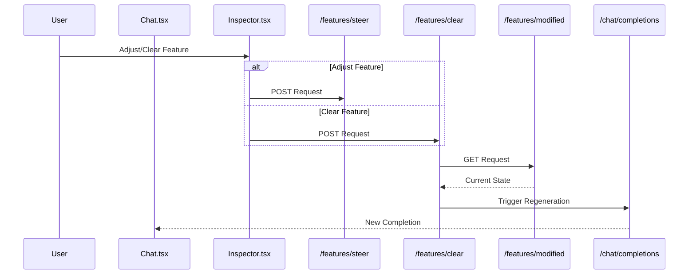

# API Documentation

## Implementation Status

This document outlines both currently implemented endpoints and planned future enhancements. Features marked with 🚧 TODO are planned for future implementation.

## Overview
The Steering Interface API provides a secure wrapper around the Goodfire Ember SDK, enabling:
- Real-time chat interactions with LLMs
- Feature activation inspection
- Dynamic feature steering
- Basic variant state management (in-memory)
- 🚧 TODO: Rate limiting and usage monitoring
- Secure SDK key management

## Base URL
```
Development: http://localhost:8000/api/v1
```

## Current Session Management
The API currently uses a simplified session model:
- Single default session ID ("default_session")
- In-memory variant storage
- Session data cleared on server restart
- No authentication required in MVP

🚧 TODO: Future session enhancements planned:
- Persistent sessions
- Multiple concurrent sessions
- Session authentication
- Session state recovery

## Endpoints

### Chat

#### Create Chat Completion
```http
POST /chat/completions
```

Creates a chat completion using the current model and variant settings.

**Request Body:**
```json
{
  "messages": [
    {
      "role": "user|assistant",
      "content": "string"
    }
  ],
  "max_completion_tokens": 512,   // optional
  "temperature": 0.7,             // optional
  "top_p": 0.9                    // optional
}
```

**Response:**
```json
{
  "content": "string",          // The model's response
  "variant_id": "string",       // ID of the variant used
  "variant_json": "string"      // Complete variant configuration
}
```

🚧 TODO: Streaming Support
- Implement streaming responses
- Add SSE endpoint for real-time updates
- Add connection recovery mechanisms

#### Health Check
```http
GET /chat/health
```

Returns API health status.

**Response:**
```json
{
  "status": "ok"
}
```

### Features

#### Inspect Features
```http
POST /features/inspect
```

Analyzes feature activations in the current conversation.

**Request Body:**
```json
{
  "messages": [
    {
      "role": "user|assistant",
      "content": "string"
    }
  ],
  "session_id": "string",
  "variant_id": "string"        // optional
}
```

**Response:**
```json
[
  {
    "label": "string",         // Feature identifier
    "activation": 0.75         // Activation value between -1 and 1
  }
]
```

#### Steer Feature
```http
POST /features/steer
```

Modifies a feature's activation value for the current variant.

**Request Body:**
```json
{
  "session_id": "string",
  "variant_id": "string",      // optional
  "feature_label": "string",
  "value": 0.5                 // Value between -1 and 1
}
```

**Response:**
```json
{
  "label": "string",
  "activation": 0.5,          // Current activation value
  "modified_value": 0.5       // Applied steering value
}
```

#### Get Modified Features
```http
GET /features/modified
```

Retrieves the complete variant state including all modifications.

**Query Parameters:**
- `session_id` (string, required)
- `variant_id` (string, optional)

**Response:** Raw variant JSON containing all modifications and settings

#### Clear Feature
```http
POST /features/clear
```

Removes a feature's modifications from the current variant.

**Request Body:**
```json
{
  "session_id": "string",
  "variant_id": "string",      // optional
  "feature_label": "string"
}
```

**Response:**
```json
{
  "label": "string"          // Cleared feature label
}
```

#### Search Features
```http
POST /features/search
```

Searches for features based on semantic similarity to a query string.

**Request Body:**
```json
{
  "query": "string",          // Search query
  "session_id": "string",
  "variant_id": "string",     // optional
  "top_k": 20                 // optional, default: 20
}
```

**Response:**
```json
[
  {
    "label": "string",        // Feature label
    "activation": 0.0         // Current activation value
  }
]
```

#### Analyze Query 
```http
POST /features/analyze-query
```

Analyzes a user query to determine optimal persona and feature categories.

**Request Body:**
```json
{
  "query": "string",           // User's query
  "session_id": "string",
  "variant_id": "string",      // optional
  "context": {                 // optional
    "previous_messages": [     // Previous conversation context
      {
        "role": "user|assistant",
        "content": "string"
      }
    ]
  }
}
```

**Response:**
```json
{
  "persona": {
    "role": "string",          // e.g., "writing coach", "technical expert"
    "style": "string",         // Communication style description
    "approach": "string"       // Problem-solving approach
  },
  "features": {
    "style": [                 // Writing style features
      {
        "label": "string",     // Feature identifier
        "importance": 0.8      // Importance score (0-1)
      }
    ],
    "reasoning": [             // Reasoning method features
      {
        "label": "string",
        "importance": 0.8
      }
    ],
    "knowledge": [             // Knowledge domain features
      {
        "label": "string",
        "importance": 0.8
      }
    ]
  }
}
```

#### Auto-Steer
```http
POST /features/auto-steer
```

Automatically applies feature steering based on query analysis.

**Request Body:**
```json
{
  "analysis": {              // Output from analyze-query
    "persona": {
      "role": "string",
      "style": "string",
      "approach": "string"
    },
    "features": {
      "style": [],
      "reasoning": [],
      "knowledge": []
    }
  },
  "session_id": "string",
  "variant_id": "string",    // optional
  "max_features": 5          // optional, max features to steer per category
}
```

**Response:**
```json
{
  "applied_features": [
    {
      "label": "string",     // Feature identifier
      "value": 0.5,         // Applied steering value
      "category": "string"   // Feature category
    }
  ],
  "variant_id": "string",    // ID of modified variant
  "variant_json": "string"   // Complete variant configuration
}
```

### Future Endpoints 🚧 TODO

#### Configuration Management
```http
POST /config/save
GET /config/load
DELETE /config/delete
```

#### Test Management
```http
POST /test/create
GET /test/status
PUT /test/update
DELETE /test/delete
```

## Error Handling

Current implementation:
- Standard HTTP status codes
- Basic error messages
- Simple error response format

🚧 TODO: Enhanced error handling:
- Detailed error codes
- SDK-specific error handling
- Retry mechanisms
- Rate limit headers
- Error tracking and monitoring

Current error responses include a detail message:
```json
{
  "detail": "Error description"
}
```

🚧 TODO: Enhanced error response format:
```json
{
  "detail": "Error description",
  "code": "ERROR_CODE",
  "sdk_error": "Original SDK error message",
  "retry_after": "timestamp"
}
```

## Variants

Variants represent different configurations of the model:
- Each session can have multiple variants
- Default variant ID: `"default"`
- Variants persist feature modifications within a session

### Current API Trigger Flows

### Message Flow

### Steering Flow
