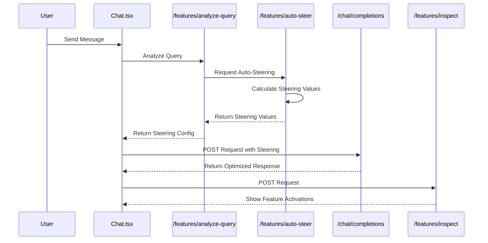
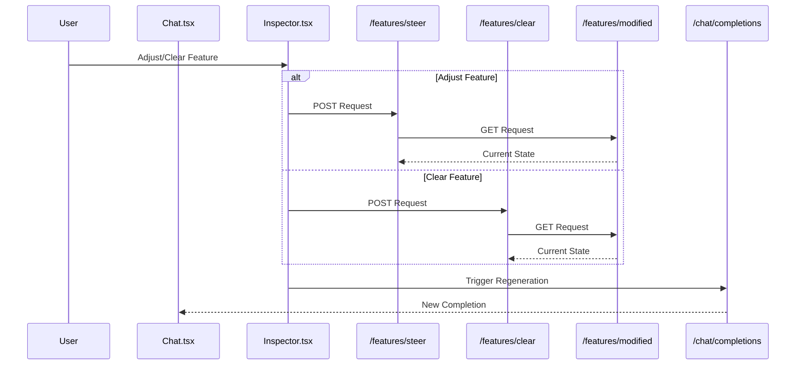
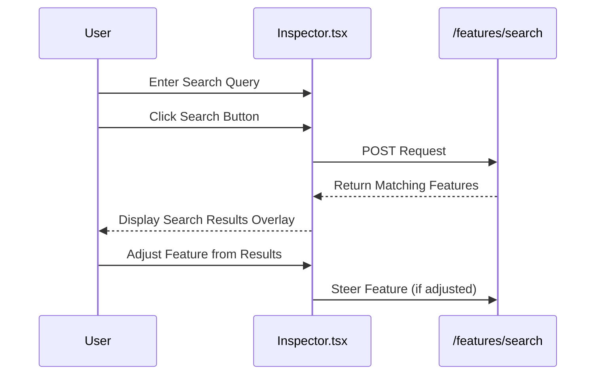
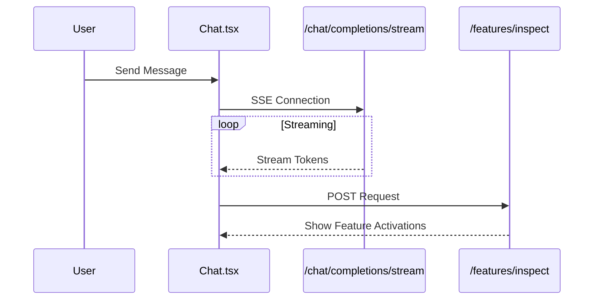
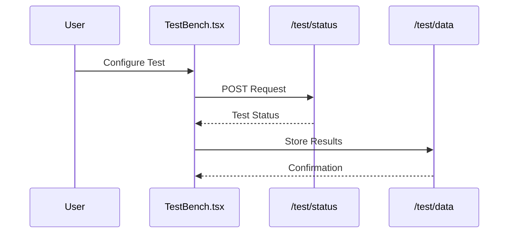

# Architecture Overview

## Implementation Status

This document outlines both currently implemented architecture components and planned future enhancements. Features marked with 🚧 TODO are planned for future implementation.

## System Overview
The system provides a real-time chat interface with feature steering capabilities, allowing users to adjust model behavior through feature controls and save configurations as model variants. It also includes a TestBench system for A/B testing different UI/UX implementations (🚧 TODO).

## Logging Architecture ✓

### Log Levels and Usage
The system implements a progressive logging strategy with clear level separation:

#### Production Environment
- **ERROR**: Application errors requiring immediate attention
  - Failed API calls
  - SDK exceptions
  - Critical system failures
- **WARNING**: Important events that don't stop functionality
  - Rate limiting events
  - Fallback behaviors
  - Performance degradation
- **INFO**: Key operational events only
  - Application startup/shutdown
  - Session creation/deletion
  - Major state changes
  - Variant creation/modification

#### Development/Staging Environments
All production levels plus:
- **DEBUG**: Detailed operational information
  - Feature modification details
  - API request/response data
  - State transitions
  - Performance metrics
- **TRACE**: Most detailed debugging information
  - Full payload logging
  - Detailed SDK interactions
  - Complete variant state dumps

### Environment Configuration
```python
# Log levels by environment
LOGGING_CONFIG = {
    "production": "INFO",
    "staging": "DEBUG",
    "development": "TRACE"
}
```

### Frontend Logging
- Custom logger utility with environment awareness
- Component-specific contexts
- Structured log format
- Console logging in development
- Error reporting in production

### Backend Logging
- Standardized log formatting
- Request correlation IDs
- Structured JSON logging
- Performance timing data
- SDK interaction logging

### Log Format Standards
```
[TIMESTAMP] [LEVEL] [COMPONENT] [CORRELATION_ID] Message
```

Example:
```
[2024-03-20 10:15:30] [INFO] [FeatureService] [sess_abc123] Feature steering applied: formal_writing=0.75
```

## Current API Trigger Flows ✓

### Message Flow


### Steering Flow


### Feature Search Flow



## Future API Trigger Flows 🚧 TODO

### Streaming Message Flow

### TestBench Flow

## Current Implementation Details ✓

### Frontend
- React + Vite application
- ShadcnUI components
- Basic chat interface
- Feature inspection panel
- Real-time feature steering
- Basic error handling

### Backend
- FastAPI application
- Ember SDK integration
- In-memory variant storage
- Basic session management
- Synchronous completions
- Basic error handling

## Future Enhancements 🚧 TODO

### Frontend
- Streaming message support
- Advanced error handling
- TestBench UI components
- Analytics dashboard
- Configuration management UI

### Backend
- Persistent storage (Vercel KV)
- Advanced session management
- Rate limiting
- Streaming support
- TestBench service
- Analytics service
- Advanced error handling


