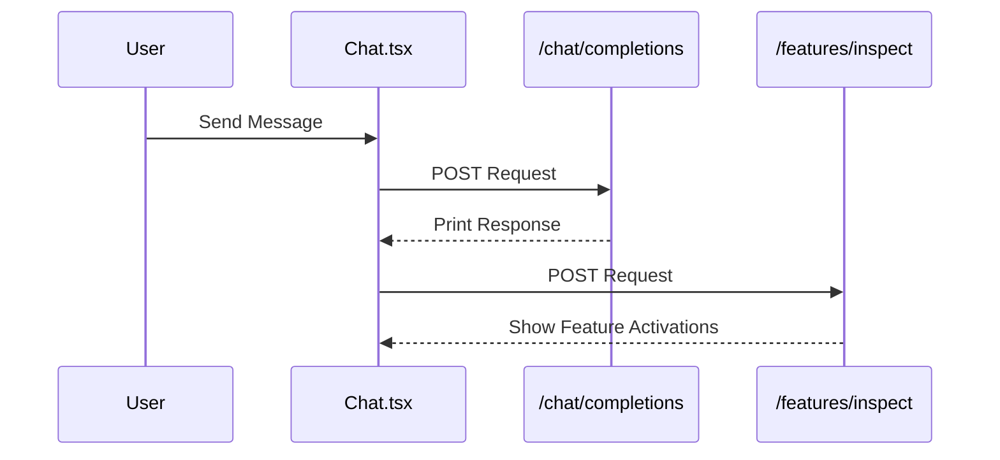
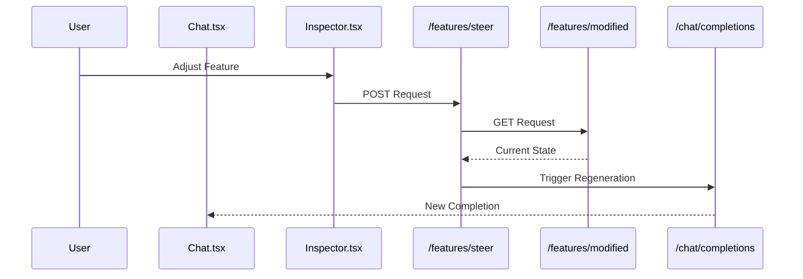
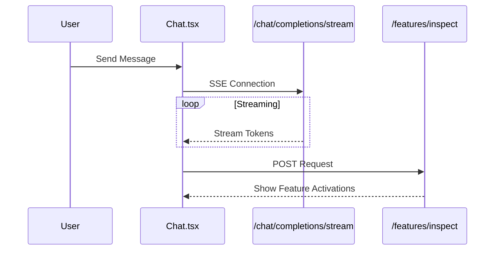
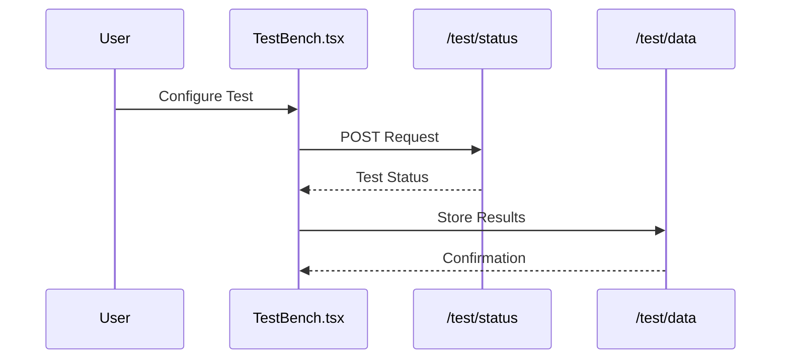

# Architecture Overview

## Implementation Status

This document outlines both currently implemented architecture components and planned future enhancements. Features marked with 🚧 TODO are planned for future implementation.

## System Overview
The system provides a real-time chat interface with feature steering capabilities, allowing users to adjust model behavior through feature controls and save configurations as model variants. It also includes a TestBench system for A/B testing different UI/UX implementations (🚧 TODO).

## Current API Trigger Flows ✓

### Message Flow

### Steering Flow

## Future API Trigger Flows 🚧 TODO

### Streaming Message Flow

### TestBench Flow

## Current Implementation Details ✓

### Frontend
- React + Vite application
- ShadcnUI components
- Basic chat interface
- Feature inspection panel
- Real-time feature steering
- Basic error handling

### Backend
- FastAPI application
- Ember SDK integration
- In-memory variant storage
- Basic session management
- Synchronous completions
- Basic error handling

## Future Enhancements 🚧 TODO

### Frontend
- Streaming message support
- Advanced error handling
- TestBench UI components
- Analytics dashboard
- Configuration management UI

### Backend
- Persistent storage (Vercel KV)
- Advanced session management
- Rate limiting
- Streaming support
- TestBench service
- Analytics service
- Advanced error handling