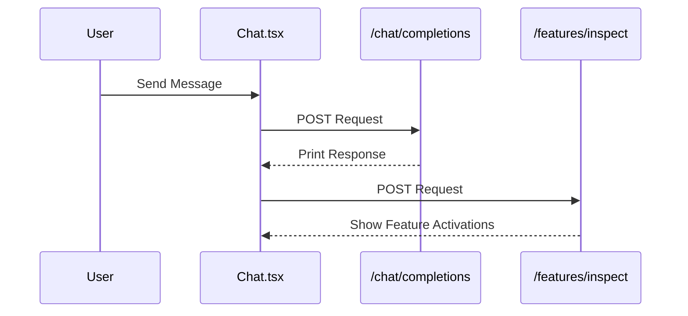
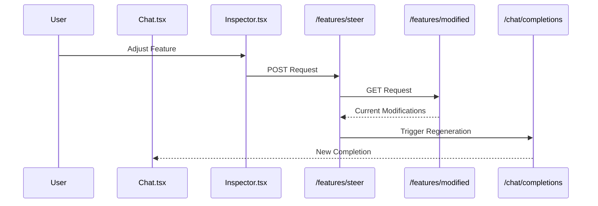
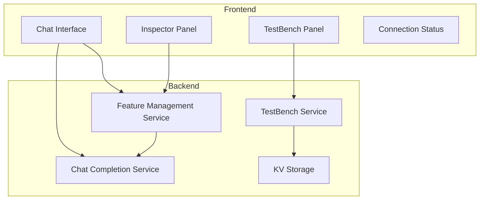

# Architecture Overview

## System Overview
The system provides a real-time chat interface with feature steering capabilities, allowing users to adjust model behavior through feature controls and save configurations as model variants. It also includes a TestBench system for A/B testing different UI/UX implementations.

## API Trigger Flows

### Message Flow

### Steering Flow

## Technical Architecture

## Deployment Architecture
- Frontend: Vite + React application
- Backend: Vercel Serverless Functions
- Storage: Vercel KV
- Edge-compatible architecture

## Session Management
- Single active session support
- Session-based message history
- Simple session token system
