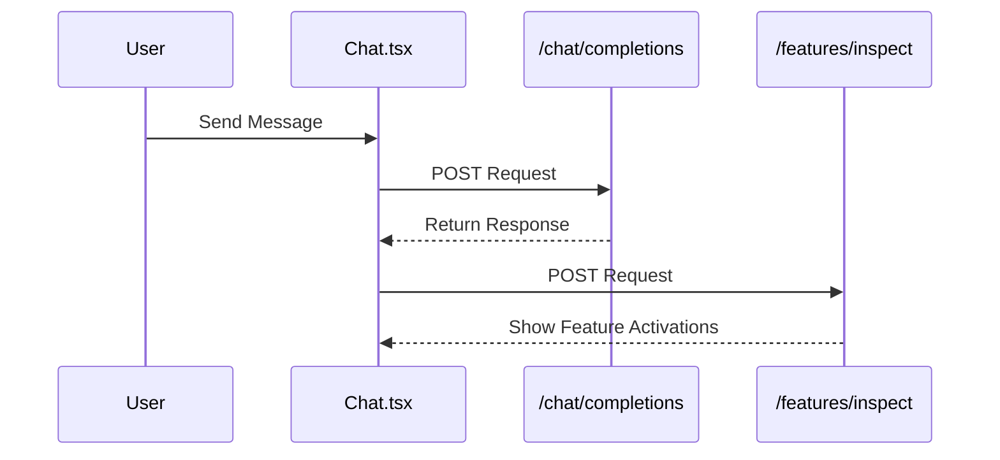
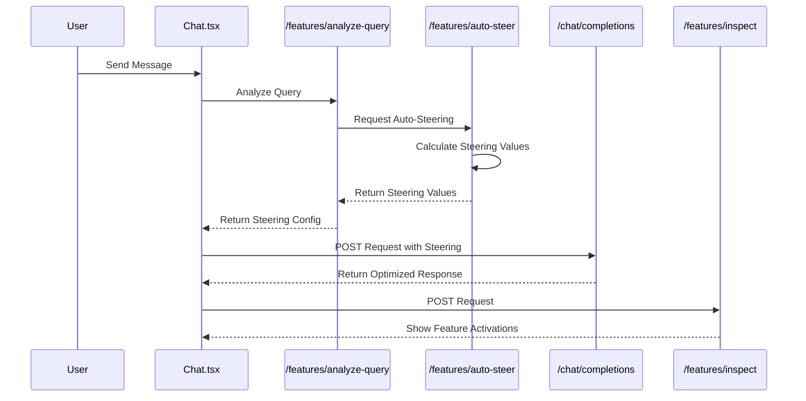
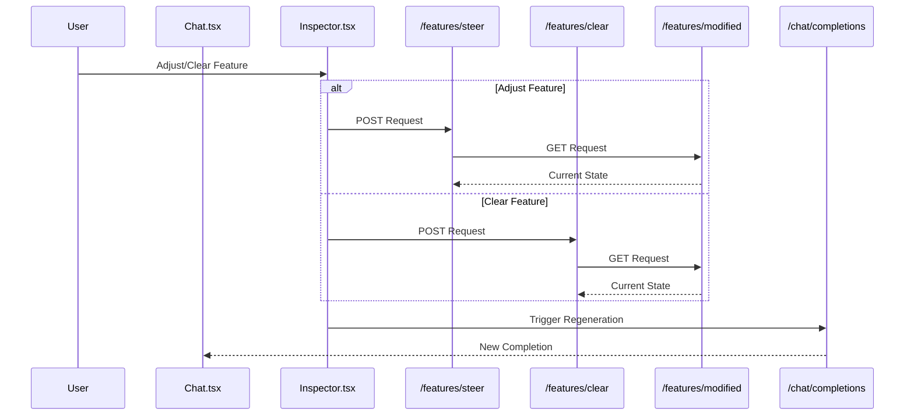
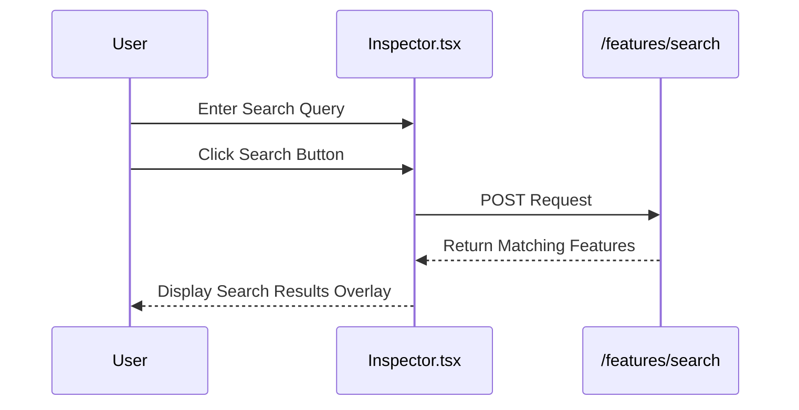
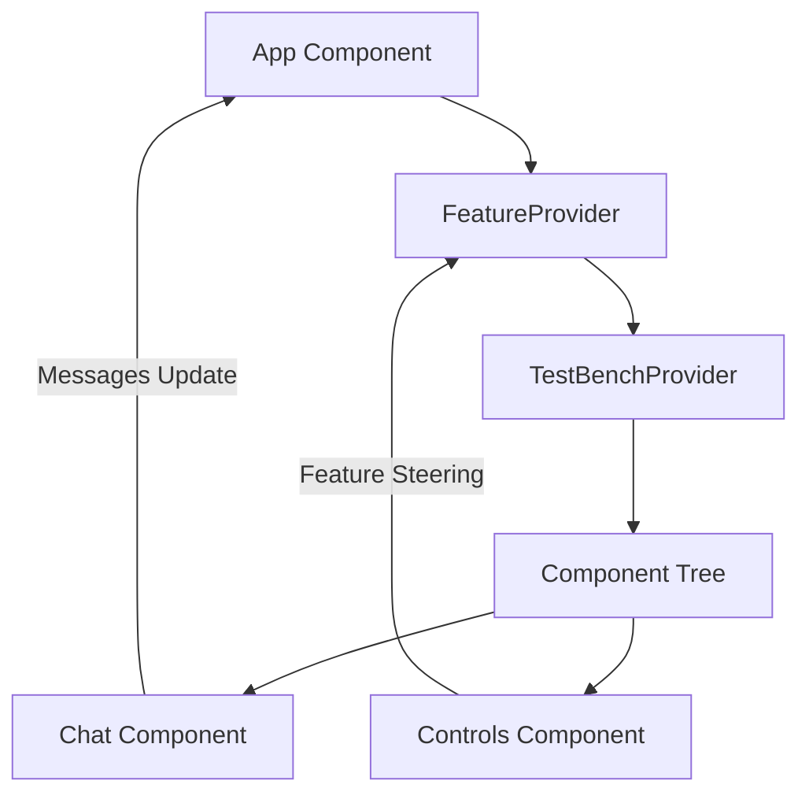

# Architecture Overview

Features marked with [TODO] are planned for future implementation.

## System Architecture

### Core API Flows 

#### Message (without autosteer)


#### [TODO] Message (with autosteer)


#### Steering Flow


#### Feature Search Flow


## Service Layer Architecture
The backend is organized into the following services with clear responsibilities:

#### Variant Service
- Manages session and variant lifecycle
- Stores and retrieves variant configurations
- Provides variant caching and persistence

#### Completion Service
- Handles chat completion requests
- Manages completion settings
- Integrates with LLM providers

#### Feature Service
- Provides feature inspection capabilities
- Handles feature steering operations
- Manages feature search and clustering

#### [TODO] Analysis Service 
- Analyzes user queries
- Determines optimal persona and features
- Provides auto-steering recommendations


## State Management

### Core State Providers

The application uses several context providers to manage different aspects of application state:

**FeatureProvider:**
- Manages feature modifications for steering LLM outputs
- Stores feature labels and their steering values
- Provides functions to set, clear, and retrieve feature modifications
- Implemented in `frontend/src/contexts/FeatureContext.tsx`

**TestBenchProvider:**
- Manages component testing configurations
- Tracks active tests and test definitions
- Allows components to register tests and manage test state
- Implemented in `frontend/src/lib/testbench/TestBenchProvider.tsx`

### State Flow Architecture

The application's state flow follows a clear hierarchy:



**State Access Pattern:**
- Components use custom hooks to access context state
- For example: `useFeatureModifications()` provides access to feature state
- This pattern encapsulates state access logic and ensures proper context usage

**State Persistence:**
- UI preferences stored in localStorage (e.g., split panel sizes)
- Feature modifications maintained in Context during the session
- Chat messages managed in local state with parent component coordination

## Development Infrastructure

### Logging Architecture 

The system implements a progressive logging strategy with clear level separation across environments:

**Log Levels by Environment:**
- **Production**: ERROR, WARNING, INFO (key operational events only)
- **Development/Staging**: All production levels plus DEBUG and TRACE

**Log Format Standard:**
```
[TIMESTAMP] [LEVEL] [COMPONENT] [CORRELATION_ID] Message
```

Example:
```
[2024-03-20 10:15:30] [INFO] [FeatureService] [sess_abc123] Feature steering applied: formal_writing=0.75
```

### Testing Architecture 

The project follows a component-based testing approach with clear separation of concerns:

**Component Tests**
Located in `src/components/*/`:
- Focus on UI behavior and rendering
- Test component-specific functionality
- Verify rendering, user interactions, and UI states

**Context Tests**
Located in `src/contexts/__tests__/`:
- Focus on business logic and state management
- Test application behavior layer
- Verify state transitions, data flow, and error handling

**Core Testing Tools:**
- Vitest as test runner
- React Testing Library for component testing
- Coverage reporting configured
