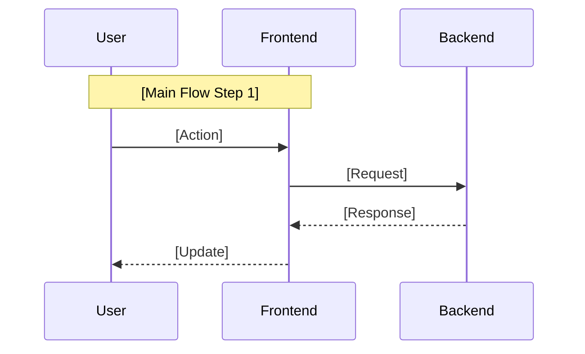

# Feature Name

## Overview
[Brief description of the feature and its primary value proposition]

## User Journey
1. [Step-by-step walkthrough of how a user interacts with the feature]
2. [Focus on core user interactions]
3. [Keep it simple and focused on MVP]

## Technical Requirements

### Core Behaviors
1. [Core Behavior 1]
   - Key requirements
   - Constraints
   - Expected outcomes

2. [Core Behavior 2]
   - Key requirements
   - Constraints
   - Expected outcomes

### Frontend Requirements
1. Components
   - List of required UI components
   - Core functionality of each component

2. State Management
   - Required state tracking
   - State transitions
   - Cleanup requirements

### Backend Requirements
1. API Endpoints
   - List of required endpoints
   - Expected request/response formats
   - Any existing endpoints to be used

2. Data Models
   - Required data structures
   - Model relationships
   - State management requirements

3. State Management
   - Server-side state requirements
   - State persistence needs
   - State cleanup/lifecycle

### API Flow


## Implementation Details

### Key Components
1. [Component 1]
   ```typescript
   // Type definitions or key interfaces
   interface ComponentState {
     // Key properties
   }
   ```

2. Lifecycle Management
   - Initialization requirements
   - Cleanup procedures
   - State transitions

### Dependencies
- Required libraries
- System dependencies
- External services

### Architecture Changes
- Required modifications to existing architecture
- New components/services
- Integration points

### Testing Requirements
1. Unit Tests
   - Key test cases
   - Edge cases to consider

2. Integration Tests
   - Critical paths
   - Error scenarios

### Security Considerations
- Authentication requirements
- Authorization rules
- Data privacy concerns

### Performance Considerations
- Expected load
- Caching requirements
- Resource constraints

### Future Considerations
[Optional section for noting potential future enhancements, but focus on MVP] 