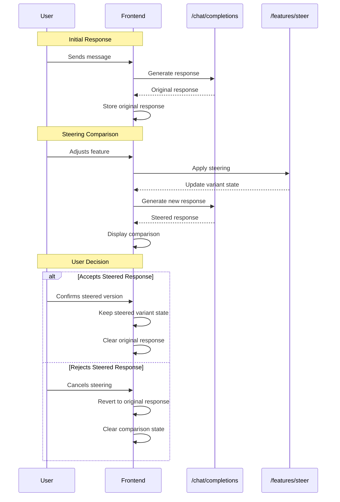

# Steering Comparison 

## Overview
This feature allows users to compare the effects of different steering actions on the same variant. This is necessary to help the user build intuition for how steering affects model outputs.

## User Journey
1. User steers on a feature
2. Model generates a steered response
3. UI displays the default and steered responses side by side (may need to generate the default response if it hasn't already been generated)
4. User selects which response to keep
5. Model updates the variant state (either confirming or rejecting the steering action)

## Technical Requirements

### Core Behaviors
1. Comparison Display
   - Only two outputs shown side-by-side at any time
   - Left side always shows "original" response (confirmed steers if any)
   - Right side shows "new" response with current parameters (pending steers)

2. Response Management
   - Original response must be stored for one conversation turn
   - Only the text content of responses is compared
   - Responses are displayed using the existing rendering system

3. Steering Flow
   - Each new steering action compares against the original response
   - Two-step confirmation process:
     a. User adjusts steering parameters to see comparison
     b. User explicitly confirms desired output
   - Upon confirmation, pending steers are confirmed and applied for future messages
   - Upon cancellation, all pending steering changes are reverted to the last confirmed state

4. Turn Management
   - A turn is defined by a user message and its corresponding model response
   - TurnId changes only when the user sends a new message
   - Users can only steer the current (most recent) message
   - Previous messages in the conversation cannot be steered

5. Multiple Feature Steering
   - Users can adjust multiple steering features before confirming (i.e. multiple features can be pending at once)
   - The "original" response shown in comparison is the last confirmed state
   - Each steering action is tracked with a status:
     - PENDING: Feature has been adjusted but not confirmed
     - CONFIRMED: Feature adjustment has been accepted
   - When generating a steered response, all PENDING features are applied together
   - After confirmation, all PENDING features become CONFIRMED
   - After rejection, all PENDING features are cleared

6. State Management
   - Variant state is managed using the SDK's built-in Variant class
   - A single primary variant instance is maintained per session
   - Pending changes are tracked separately from confirmed changes
   - System maintains three key pieces of state:
     a. Current variant (SDK Variant instance with all changes)
     b. Pending features map (feature_label -> value)
     c. Last confirmed state (JSON serialized variant)
   - State transitions:
     - When applying pending changes: Update both variant and pending features map
     - When confirming changes: Clear pending features map and save variant as confirmed state
     - When canceling changes: Restore variant from last confirmed state and clear pending map

   Additional Behaviors:
   - Initial State:
     - lastConfirmedState is initialized when variant is first created
     - Empty variant state is used as initial confirmed state
   
   - Concurrent Operations:
     - Users can adjust features while response generation is in progress
     - When a new adjustment is made:
       - Cancel the current in-progress generation
       - Start generating new response with updated parameters
       - UI should indicate generation is in progress
     - Pending features are updated immediately in the UI
   
   - Error Recovery:
     - On generation failure, pending features are preserved
     - User can retry generation or cancel changes
     - Error state is displayed in comparison view

### Frontend Requirements
1. Components
   - Split-view comparison container
   - Steering control panel
   - Confirmation/cancel buttons for steering choices
   - Visual indicator for original vs. steered content

2. State Management
   - Track original response for current turn
   - Track current steering parameters
   - Track comparison state (viewing/confirming)

### Backend Requirements
1. API Endpoints
   We'll utilize these existing endpoints from our API:
   - `/chat/completions`: Generate both original and steered responses
   - `/features/steer`: Apply steering parameters to the variant
   
   No new endpoints are required as:
   - Original response storage is handled in frontend state
   - Steering confirmation is implicit when keeping the steered variant state
   - Cancellation is handled by frontend state management

2. Data Models
   The existing variant state model contains all necessary data:
   - Variant configuration (from `/features/steer` responses)
   - Steering parameters (tracked in variant state)
   - Chat completion responses (from `/chat/completions`)

3. State Management
   - All temporary state (original response, comparison state) is managed in the frontend
   - Persistent state (variant configuration) is managed through existing variant storage

### API Trigger Flow


## Implementation Plan

### Phase 1: Basic Turn Management & Response Storage
1. Add TurnId Management
   - Implement turnId generation on new messages
   - Add currentTurnId tracking to chat state
   - Add tests for turn transitions

2. Implement Response Storage
   - Add ComparisonState interface and basic state management
   - Implement originalResponse storage logic
   - Add cleanup handlers for turn changes
   - Add tests for response storage lifecycle

### Phase 2: Single Feature Steering
1. Add Steering State Management
   - Implement PENDING/CONFIRMED feature status tracking
   - Add state updates for single feature adjustment
   - Add tests for feature state transitions

2. Implement Basic Comparison UI
   - Create side-by-side comparison component
   - Add basic steering controls for single feature
   - Add confirmation/cancel buttons
   - Add tests for UI interactions

3. Connect to API
   - Integrate with `/chat/completions` for steered response
   - Integrate with `/features/steer` for variant updates
   - Add tests for API integration

### Phase 3: Multiple Feature Steering
1. Extend State Management
   - Update state handling for multiple PENDING features
   - Implement combined feature application logic
   - Add tests for multiple feature state management

2. Enhance UI
   - Update comparison view to show multiple feature changes
   - Extend steering controls to handle multiple features
   - Add tests for multiple feature UI handling

3. Update API Integration
   - Modify API calls to handle multiple feature parameters
   - Add tests for multiple feature API integration

### Phase 4: Final Integration & Polish
1. Error Handling
   - Add error states for API failures
   - Implement graceful fallbacks
   - Add error case tests

2. State Cleanup
   - Implement comprehensive cleanup on turn changes
   - Add cleanup for cancelled steering
   - Add tests for cleanup scenarios

3. Final Integration Testing
   - End-to-end testing of complete workflows
   - Performance testing for state management
   - Cross-browser testing for UI components

## Implementation Details

### Response Storage
1. Frontend State Management
   ```typescript
   interface ComparisonState {
     originalResponse: {
       content: string;
       turnId: string;
       timestamp: number;
     } | null;
     isComparing: boolean;
     currentTurnId: string;
     pendingFeatures: {
       featureId: string;
       parameters: SteeringParameters;
       status: 'PENDING' | 'CONFIRMED';
     }[];
   }
   ```

2. Lifecycle Management
   - Original response is stored when:
     - User receives initial response
     - Before applying first steering action in a turn
   - Storage is cleared when:
     - User confirms a steering choice (parameters become new defaults)
     - User sends a new message (new turn)
     - User cancels steering (reverts to last confirmed state)
     - Turn ID changes

3. Memory Considerations
   - Only one original response stored at a time
   - Automatic cleanup on turn changes
   - No persistence needed between page reloads

### Dependencies
- State management library (e.g., React Context or Redux)
- Unique ID generator for turn tracking

### Architecture Changes
- Add ComparisonState to frontend state management
- Add turn tracking to chat interface
- Add cleanup handlers for state management

### State Management
1. Frontend State Management
   ```typescript
   interface SteeringState {
     variant: Variant;                    // SDK Variant instance
     pendingFeatures: Map<string, number>;  // Tracks pending feature modifications
     lastConfirmedState: string;          // JSON string of last confirmed variant
     isComparing: boolean;
     currentTurnId: string;
   }
   ```

2. State Transitions
   ```typescript
   // Apply pending change
   function applyPendingChange(feature: string, value: number) {
     pendingFeatures.set(feature, value);
     variant.set(feature, value);
   }

   // Confirm changes
   function confirmChanges() {
     pendingFeatures.clear();
     lastConfirmedState = variant.json();
   }

   // Cancel changes
   function cancelChanges() {
     variant = Variant.from_json(lastConfirmedState);
     pendingFeatures.clear();
   }
   ```

3. Lifecycle Management
   - Original response is stored when:
     - User receives initial response
     - Before applying first steering action in a turn
   - Storage is cleared when:
     - User confirms a steering choice (parameters become new defaults)
     - User sends a new message (new turn)
     - User cancels steering (reverts to last confirmed state)
     - Turn ID changes
