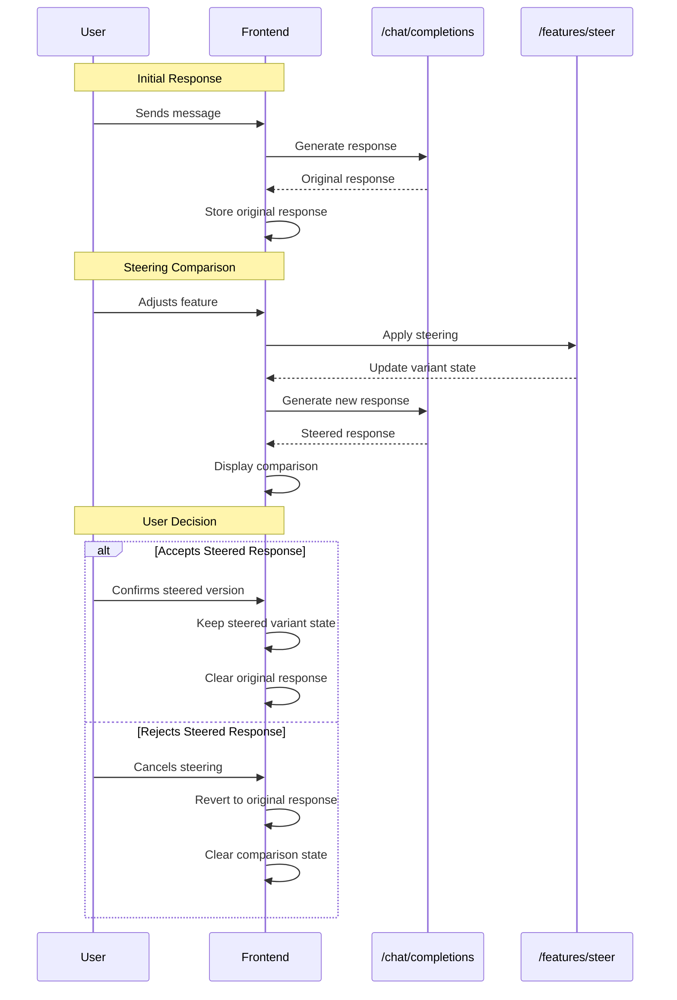

# Steering Comparison 

## Overview
This feature allows users to compare the effects of different steering actions on the same variant. This is necessary to help the user build intuition for how steering affects model outputs.

## User Journey
1. User steers on a feature
2. Model generates a steered response
3. UI displays the default and steered responses side by side (may need to generate the default response if it hasn't already been generated)
4. User selects which response to keep
5. Model updates the variant state (either confirming or rejecting the steering action)

## Technical Requirements

### Core Behaviors
1. Comparison Display
   - Only two outputs shown side-by-side at any time
   - Text above the split view shows "Which response do you prefer?"
   - Left side always shows "original" response (confirmed steers if any)
   - Right side shows "new" response with current parameters (pending steers)
   - User can click on the response they prefer which triggers confirmation/cancellation flow

2. Response Management
   - If the original response has already been generated, we should use that response for the comparison (don't generate a new response)
   - Only the text content of responses is compared
   - Responses are displayed using the existing rendering system

3. Steering Flow and Multiple Features
   - Each new steering action compares against the original response
   - Users can adjust multiple steering features before confirming (i.e. multiple features can be pending at once)
   - Two-step confirmation process:
     a. User adjusts steering parameters to see comparison
     b. User explicitly confirms desired output
   - The "original" response shown in comparison is the last confirmed state
   - Each steering action is tracked with a status:
     - PENDING: Feature has been adjusted but not confirmed
     - CONFIRMED: Feature adjustment has been accepted
   - When generating a steered response, all PENDING features are applied together
   - Upon confirmation:
     - All pending steers are confirmed and applied for future messages
     - All PENDING features become CONFIRMED
   - Upon cancellation:
     - All pending steering changes are reverted to the last confirmed state
     - All PENDING features are cleared

4. State Management
   - Variant state is managed using the SDK's built-in Variant class
   - A single primary variant instance is maintained per session
   - Pending changes are tracked separately from confirmed changes
   - System maintains three key pieces of state:
     a. Current variant (SDK Variant instance with all changes)
     b. Pending features map (feature_label -> value)
     c. Last confirmed state (JSON serialized variant)
   - State transitions:
     - When applying pending changes: Update both variant and pending features map
     - When confirming changes: Clear pending features map and save variant as confirmed state
     - When canceling changes: Restore variant from last confirmed state and clear pending map

   Additional Behaviors:
   - Initial State:
     - lastConfirmedState is initialized when variant is first created
     - Empty variant state is used as initial confirmed state
   
   - Concurrent Operations:
     - Users can adjust features while response generation is in progress
     - When a new adjustment is made:
       - Cancel the current in-progress generation
       - Start generating new response with updated parameters
       - UI should indicate generation is in progress
     - Pending features are updated immediately in the UI
   
   - Error Recovery:
     - On generation failure, pending features are preserved
     - User can retry generation or cancel changes
     - Error state is displayed in comparison view


### API Trigger Flow


## Technical Specification

### Component Structure

#### 1. Enhanced ComparisonContext
Leveraging the existing ComparisonContext to manage variant state transitions:

```typescript
interface ComparisonState {
  originalResponse: ResponseState | null;
  steeredResponse: ResponseState | null;
  isComparing: boolean;
  isLoading: boolean;
  error: string | null;
}

interface ResponseState {
  content: string;
  timestamp: number;
  variantState: string;
}

interface PendingFeature {
  featureId: string;
  featureLabel: string;
  value: number;
  status: 'PENDING' | 'CONFIRMED';
  timestamp: number;
}

interface PendingFeaturesState {
  features: Map<string, PendingFeature>;
  lastConfirmedVariantState: string;
}
```

#### 2. Chat Component Enhancement
Update existing Chat component to:
1. Subscribe to ComparisonContext
2. Toggle between standard and comparison view
3. Handle response selection

```typescript
interface ChatProps {
  messages: ChatMessage[];
  onSendMessage: (message: string) => void;
  isLoading: boolean;
  // New props for comparison
  originalResponse?: string | null;
  steeredResponse?: string | null;
  isComparing: boolean;
  onSelectOriginal: () => void;
  onSelectSteered: () => void;
}
```

#### 3. FeatureControl Component Enhancement
Extend FeatureControl to dispatch steering actions to ComparisonContext:

```typescript
interface FeatureControlProps {
  feature: FeatureActivation;
  // New props
  isPending: boolean;
  onSteer: (feature: string, value: number) => void;
}
```

### API Methods

#### ComparisonService Interface
Create a minimal service for comparison operations using existing API endpoints:

```typescript
interface ComparisonService {
  generateComparison(
    messages: ChatMessage[],
    pendingFeatures: PendingFeature[],
    variantId?: string
  ): Promise<{
    original: string;
    steered: string;
    originalState: string;
    steeredState: string;
  }>;
  
  applyPendingFeatures(
    features: PendingFeature[],
    variantId?: string
  ): Promise<void>;
  
  confirmComparison(
    variantId?: string
  ): Promise<void>;
  
  rejectComparison(
    variantId?: string
  ): Promise<void>;
}
```

#### ComparisonService Implementation
Implement using existing API endpoints:

```typescript
class ComparisonServiceImpl implements ComparisonService {
  // Uses existing /features/steer endpoint for pending features
  // Uses existing /chat/completions endpoint for generating responses
  // Uses existing /features/modified endpoint for variant state management
}
```

### Variant Management

#### VariantManager Interface
Create a lightweight interface for variant operations:

```typescript
interface VariantManager {
  applyPendingChanges(features: PendingFeature[]): void;
  confirmPendingChanges(): void;
  revertToConfirmed(): void;
  getCurrentState(): string;
  getLastConfirmedState(): string;
}
```

#### Implementation Approach
1. Use the existing ComparisonContext to track pending vs confirmed features
2. Use the existing SplitView component to display comparison UI
3. Enhance feature controls to indicate pending vs confirmed state
4. Add handlers in Chat component to manage user selection

### Event Flow

1. **Feature Adjustment**:
   - User adjusts feature in UI
   - `ComparisonContext.addPendingFeature()` is called
   - Feature is marked as PENDING in state
   - If comparison already active, cancel current generation
   - Generate new steered response with all pending features

2. **Comparison Generation**:
   - If originalResponse exists, use it
   - Otherwise, generate using last confirmed variant state
   - Generate steered response with all pending features applied
   - Display both responses in SplitView component

3. **User Selection**:
   - User clicks on preferred response
   - If original selected: `ComparisonContext.rejectComparison()`
   - If steered selected: `ComparisonContext.confirmComparison()`
   - ComparisonContext updates variant state accordingly
   - UI exits comparison mode

### Integration Points

1. **Chat.tsx**: Display SplitView component when isComparing=true
2. **Controls.tsx**: Update to show pending vs confirmed feature status
3. **DiscreteFeatureCard.tsx**: Trigger comparison on adjustment
4. **API Integration**: Use existing endpoints with enhanced client-side state management

## Implementation Plan

### 1. State Management Updates
1.1. Update ComparisonContext.tsx
   - Remove turnId from ComparisonState interface
   - Update reducers to handle simplified state transitions
   - Add isLoading and error fields to state

1.2. Implement VariantManager interface
   - Create implementation class for variant operations
   - Connect to existing variant state management
   - Add methods for applying, confirming, and reverting changes

### 2. Core Service Implementation
2.1. Create ComparisonService interface & implementation
   - Implement generateComparison method using existing API endpoints
   - Implement applyPendingFeatures method
   - Implement confirmComparison and rejectComparison methods

### 3. Chat Component Integration
3.1. Enhance Chat.tsx
   - Add conditional rendering for SplitView
   - Connect ComparisonContext actions
   - Add handlers for selection actions

3.2. Update message rendering
   - Ensure message components work with comparison view

### 4. API Integration
4.1. Connect ComparisonService to backend
   - Integrate with existing API endpoints
   - Implement error handling

4.2. Implement cancellation logic
   - Add support for cancelling in-flight requests
   - Handle race conditions in comparison flow

### 5. Final Integration & Polish
5.1. Connect all components end-to-end
   - Ensure ComparisonContext is properly provided
   - Wire up all event handlers

5.2. Add loading & error states
   - Implement UX for generation in progress
   - Add error recovery flow

5.3. Final styling and UX improvements
   - Polish transitions between states
   - Ensure mobile responsiveness


