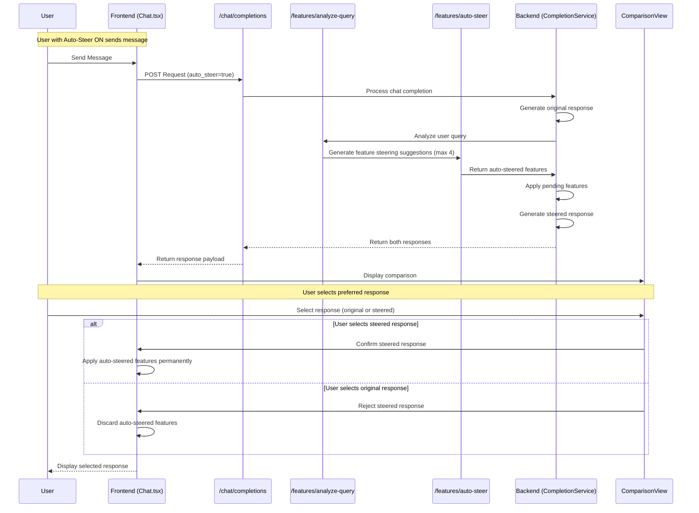

# Auto-Steer Feature

## Overview
The Auto-steer feature provides automated assistance in optimizing LLM responses based on user queries. When enabled, the system will analyze the user's query, suggest relevant feature adjustments, and generate a comparison between the original and steered responses. This allows users to benefit from intelligent steering without manual feature selection, while retaining control over whether to accept the suggested adjustments.

## User Journey
1. User toggles Auto-Steer ON via the Controls panel
2. User sends a message in the chat interface
3. Backend generates two responses: one with the current variant configuration, and one after analyzing the query and auto-steering relevant features (limited to max 4 features)
4. User is presented with original and auto-steered response options
5. User selects preferred response (steered or original)
6. System either applies or discards the auto-steering based on user selection 
7. Conversation continues with the selected response and steering configuration (note that steps 4–7 mirror the existing behavior of the steering flow)

## Technical Requirements

### Core Behaviors
1. Auto-Steer Toggle
   - Toggle UI component integrated in Controls.tsx
   - No persistence across sessions required
   - Visually indicates active state
   - Default state is OFF

2. Query Analysis and Feature Steering
   - Analyze user query semantically
   - Determine relevant features to steer based on query intent
   - Limit auto-steer suggestions to maximum 4 features
   - Apply steering values to pending features array
   - Generate comparison between original and steered responses

3. User Selection Flow
   - Present both responses in ComparisonView
   - Allow user to select preferred response
   - Apply or discard steering based on selection
   - Use existing loading states from SteeringLoadingState enum

### Frontend Requirements
1. Components
   - Auto-Steer toggle switch in Controls.tsx
   - State indicator for when Auto-Steer is active
   - Integration with existing ComparisonView for response selection

2. State Management
   - Track Auto-Steer enabled state in VariantContext
   - Pass Auto-Steer flag in chat completion requests
   - Manage pending features from auto-steer suggestions
   - Utilize existing SteeringLoadingState for loading states

### Backend Requirements
1. API Endpoints
   - Modify /chat/completions to support auto-steer parameter
   - Utilize existing /features/analyze-query and /features/auto-steer endpoints
   - Return both original and steered responses when auto-steer is enabled

2. Data Models
   - Add auto_steer flag to chat completion request model
   - Maintain original response alongside steered response in response payload
   - Enforce limit of 4 auto-steered features

3. State Management
   - Maintain variant integrity while generating multiple responses
   - Use pending features mechanism for auto-steer suggestions
   - Ensure proper cleanup of pending features on rejection

### API Flow


## Implementation Details

### Key Components
1. Auto-Steer Toggle
   ```typescript
   interface AutoSteerToggleProps {
     enabled: boolean;
     onToggle: (enabled: boolean) => void;
   }
   ```

2. CompletionService Extensions
   ```python
   async def create_chat_completion(
       self,
       messages: List[ChatMessage],
       session_id: str,
       variant_id: Optional[str] = None,
       auto_steer: bool = False,  # New parameter
       stream: bool = False,
       max_completion_tokens: Optional[int] = 256,
       temperature: Optional[float] = 0.7,
       top_p: Optional[float] = 0.9
   ) -> ChatResponse:
       # Implementation details...
   ```

3. Variant Context Extensions
   ```typescript
   interface VariantContextState {
     // Existing properties
     autoSteerEnabled: boolean;
     setAutoSteerEnabled: (enabled: boolean) => void;
   }
   ```

4. Loading State Integration
   ```typescript
   // Using existing SteeringLoadingState enum from loading.ts
   // May reuse states such as:
   // - APPLYING_FEATURES
   // - GENERATING_RESPONSE
   // - COMPARING
   // - CONFIRMING
   // - CANCELING
   ```

### Dependencies
- CompletionService
- AnalysisService (with limit of 4 features for auto-steering)
- FeatureService
- VariantContext
- Existing ComparisonView component
- UI Switch component
- Existing loading state management

### Architecture Changes
- Add auto-steer flag to chat completion request and response models
- Use existing pending features mechanism for auto-steer suggestions
- Enhance CompletionService to optionally call AnalysisService
- Extend VariantContext to manage auto-steer state
- Add toggle switch to Controls component
- Apply limit of 4 features for auto-steering

### Future Considerations
- Auto-steer usage analytics to improve feature suggestions
- Fine-grained control over which feature categories are eligible for auto-steering
- Explanations for why specific features were selected for auto-steering

## Implementation Plan

1. Frontend Toggle Integration
- Add the auto-steer toggle to Controls.tsx using the existing Switch component
- Extend VariantContext to include autoSteerEnabled state and setter function
- Ensure toggle state is correctly visualized and updated
- No backend integration yet; this step focuses on UI preparation only

2. Backend Support for Auto-Steer Flag
- Modify CompletionService to accept the auto_steer parameter
- Update API request/response models to include the auto-steer flag
- Add basic logging for auto-steer requests
- No actual auto-steering yet; just establish the communication channel

3. Auto-Steer Response Generation
- Implement the core auto-steering logic in CompletionService
- Connect to existing AnalysisService.analyze_query and auto_steer methods
- Apply the 4-feature limit to auto-steer suggestions
- Ensure proper generation of both original and steered responses
- Return both responses in the chat completion response

4. Frontend Integration with Comparison Flow
- Connect the frontend toggle state to the backend API calls
- Modify Chat.tsx to pass auto-steer flag in requests when enabled
- Leverage existing ComparisonView to show original vs steered responses
- Ensure proper handling of confirming/canceling auto-steered features
- Verify end-to-end flow and test with various query types 